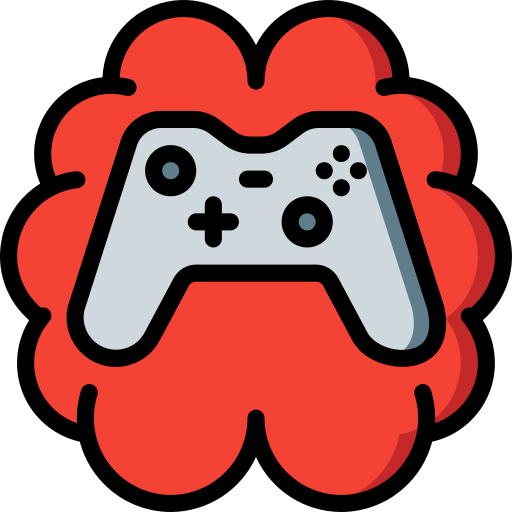
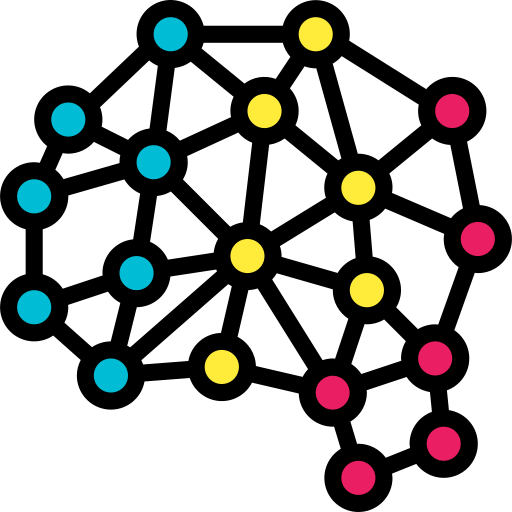
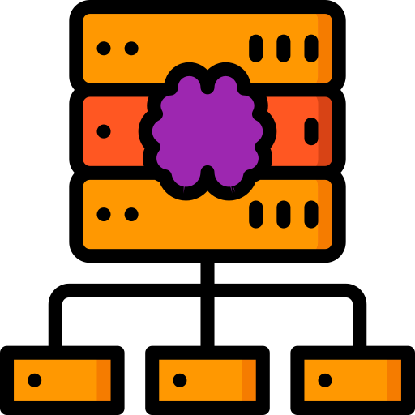
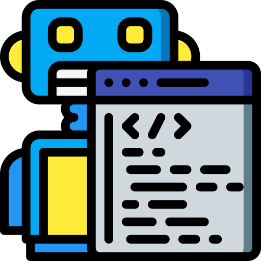
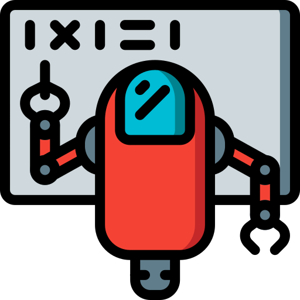

# Cadre AI Game Framework

Cadre is an open source collection of micro services to allow for quick development of AIs, and the games they play.

[View our code on Github](http://github.com/siggame/Cadre)

## What is an AI Game Framework?

Artificial Intelligence is becoming more mainstream, and Cadre wants to help! The Cadre AI game framework is a
collection of programs that makeup a platform for games to be played, but with AIs as the main competitors.

Games that would normally be the domains of humans, such as strategy games, can be created with APIs for AIs (programs)
to easily interact with, all through Cadre; complete with open source tooling and support.

## Our Tech Stack

Our technical stack is focused on development speed and runtime speed. Currently we utilize mostly web technologies
such as [TypeScript] and [Node.js] to accomplish this as they are iterating at a blistering pace. However, each
component is independent of the others so future developers can come in improve or replace as they see fit.

Also, we name all our modules after _French_ words. There's no real reason for this, it just gives us semi unique names
that makes sense while not being as boring as just "Server" or "Client".

### Cerveau - The Game Server

[Cerveau] is the _brain_ of this setup. It acts as both an abstraction layer between AIs of varying architectures;
and as the single source of game logic truth during a game.

Cerveau is a [Node.js] application written in [TypeScript],
that exposes TCP, WS, and HTTP hooks for various AIs to connect to play games. Because AIs can send commands
significantly faster than a human could watch, every action in the game is logged to files we call `gamelogs` for
developers to help debug and improve their AIs after games are played.

### Viseur - The visualization engine

To help human developers understand what their AIs did during games, [Viseur] enables them to set their _sights_ on
the game in a format any video game player is more familiar with vis this SPA (Single Page Application).

Developers can step through the game action by action, as you could a flip clip, and see how the game progressed.
This makes the games more exciting to watch rather than watch console output fly past, and greatly speeds up AI
development as the information is made more easily understandable.

### Joueur - The AI clients

We believe that there should not be a programming language barrier when crafting your AI for all _players_.

To enable each developer to be as comfortable as possible, we have crafted a client "shell" program that handles all
the hard work: network I/O, game state parsing, consuming and interacting with each game's API, etc. We then expose a
single `ai.lang` file for each game so you can just right into coding the smartest AI for each game. Coders can then
interact with the game via game objects native to that language's style and syntax.

#### Currently supported languages

- [C++][Joueur.cpp]
- [C#][Joueur.cs]
- [Go][Joueur.go]
- [Java][Joueur.java]
- [JavaScript][Joueur.js]
- [Lua][Joueur.lua]
- [Python 3][Joueur.py]
- [Typescript][Joueur.ts]

Additional clients are being worked on in Lisp, PHP, and Rust. If you'd like to see a language added,
or would like to contribute yourself we'd love to [hear from you][issues].

### Creer - The code generator

Tying all these systems together for one game involves a lot of boilerplate code that no developer wants to write.
That is where [Creer], the _creator_ comes in as a metaprogramming tool.

We create a single [YAML] file that describes
the game's structure and actions, and Creer writes the code for **all** our components so development can start as
quickly as possible.

## Our Games

Games made in Cadre tend to be strategy games, as those are the simplest for developers to wrap their head around when
crafting an AI. However, the entire framework is opinionated and would allow for anything you can code.

We currently support some common games such as Checkers and Chess, and many more custom games such as the cowboy
brawling [Saloon] and the abstract node traversal game [Spiders]; and many more!

## Credits

Cadre is maintained primarily by [MST]'s ACM [SIG-Game] organization for various AI tournaments. Thank you to the many
tireless developers and competitors that game-on each semester.

[Cerveau]: https://github.com/siggame/Cerveau
[Creer]: https://github.com/siggame/Creer
[Joueur.cpp]: https://github.com/siggame/Joueur.cpp
[Joueur.cs]: https://github.com/siggame/Joueur.cs
[Joueur.go]: https://github.com/siggame/Joueur.go
[Joueur.java]: https://github.com/siggame/Joueur.java
[Joueur.js]: https://github.com/siggame/Joueur.js
[Joueur.lua]: https://github.com/siggame/Joueur.lua
[Joueur.py]: https://github.com/siggame/Joueur.py
[Joueur.ts]: https://github.com/siggame/Joueur.ts
[Viseur]: https://github.com/siggame/Viseur

[issues]: https://github.com/siggame/Creer/issues

[Saloon]: https://github.com/siggame/Cadre/tree/master/Games/Saloon
[Spiders]: https://github.com/siggame/Cadre/tree/master/Games/Spiders

[MST]: http://mst.edu/
[SIG-Game]: http://siggame.io/

[TypeScript]: https://www.typescriptlang.org/
[Node.js]: https://nodejs.org/
[YAML]: http://yaml.org/
